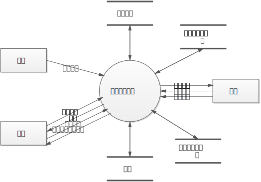
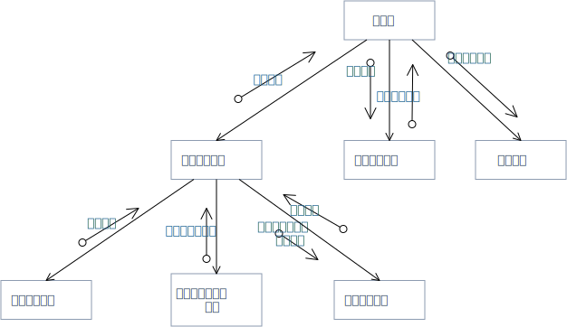
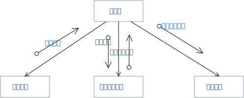

# 分布式温控系统结构化概要设计

> 2014211306 班 F 组
>
> 李俊宁 董星彤 张有杰 赵亮 左旭彤
>
> 2017 年 06 月 05 日

[heading-numbering]

## [toc-heading] [no-number] Table of Contents

[TOC]

## [no-number] 迭代历史

> - v0.1 | 2017/6/5 | John Lee | 创建文档
> - v0.2 | 2017/6/6 | 董星彤 | 更新各层数据流图，添加各子系统数据流图
> - v0.3 | 2017/6/6 | 董星彤 | 添加各子系统系统结构图

## 文档说明

### 文档目的

### 文档范围

### 读者对象

### 参考文档

### 术语和缩写

## 项目背景

## 需求分析结果

### 第 0 层数据流图

### 第 1 层数据流图

### 第 2 层数据流图

## 基于功能需求的初始功能结构图

> 结合以上分层的数据流图，将整个系统对应的数据流图划分成多个功能相对独立的子系统，每个子系统由一个或多个结合紧密的加工组成。比如教科书(教材第132页)，从“医院就诊管理系统”的第一层数据流图可以看出，它由三（或四）个相对功能独立的子系统组成，分别是挂号子系统、问诊子系统、交费（和取药）子系统。

### 子系统1：调节子系统

#### 数据流图

#### 功能结构图

#### 功能模块说明

> 为功能结构图中每一个模块写一份处理说明和一份接口说明

1. 模块名字 1（与功能结构图中名字相同）
  - 处理说明 // 参见教科书（教材223页8.7.1）
  - 接口说明 // 参见教科书（教材224页8.7.2），只需要说明入口参数、返回值、下属模块、上级模块
2. 模块名字 2
  - 处理说明
  - 接口说明

### 子系统2：报表管理子系统

#### 数据流图

#### 功能结构图

### 子系统3：房间信息定时更新子系统

#### 数据流图

#### 功能结构图

### 子系统4：房客信息管理子系统

#### 数据流图

#### 功能结构图

### 子系统5：实时信息查看子系统

#### 数据流图

#### 功能结构图

### 子系统6：配置空调参数子系统

#### 数据流图

#### 功能结构图

### 子系统7：能耗费用计算子系统

#### 数据流图

#### 功能结构图

### 子系统8：从控机信息显示子系统

#### 数据流图

#### 功能结构图

### 子系统9：从控机登录认证子系统

#### 数据流图

#### 功能结构图

## 系统级初始功能结构图

> 根据上一小节的功能结构图进行归纳和合并，给出一个系统级的初始功能结构图，即需要将第4节中的每个子系统功能结构图合并成一个完整的功能结构图。最简单的合并方式就是设定一个总调度模块，名字和整个系统名字相同，然后下面的第一级模块就是每个子系统的主模块。

## 优化后的系统级功能结构图

> 基于初始功能结构图，按照启发式原则进行某些模块的合并和优化，使其满足“高内聚低耦合”特性，形成最终的可执行的系统功能结构图，是详细设计和编码的依据。

## 数据设计

> 本节给出数据库逻辑结构设计，给出系统各个模块需要的全局数据结构

### 数据库设计

#### E-R图

> 将基于结构化数据流图的《需求分析规格说明书》中ER图直接拷贝过来，无须进行修改。

#### 数据库表结构

> 根据ER图，设计出对应的表结构

##### 计费参数维护表

Table | xxx
--|--
Version |
Purpose |
Primary Key |
Foreign Key |
Index |

Column | Type | Length | NULL | Illustration
--|--|--|--|--

#### 数据表关系

### 全局数据结构设计

> 给出系统全局数据结构设计，包括全局常量和全局变量，说明每个数据结构的作用。