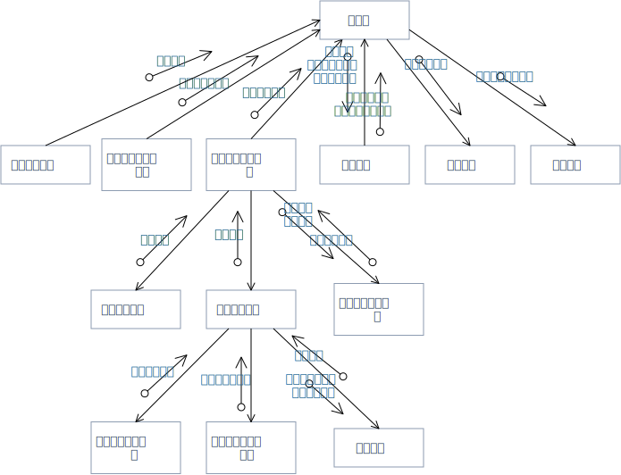
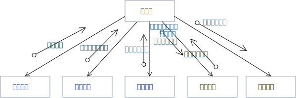
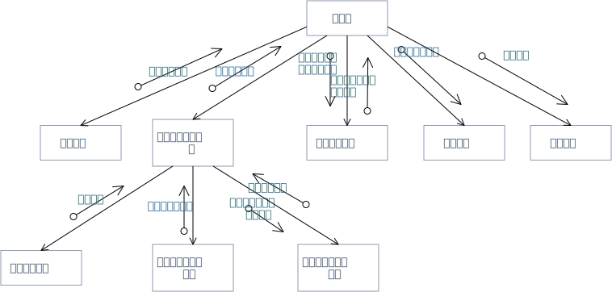
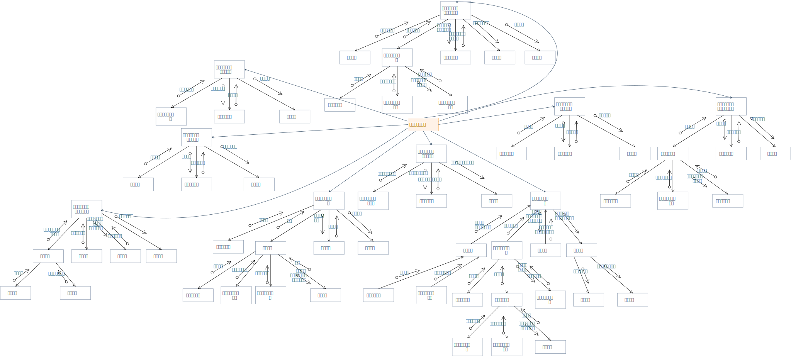
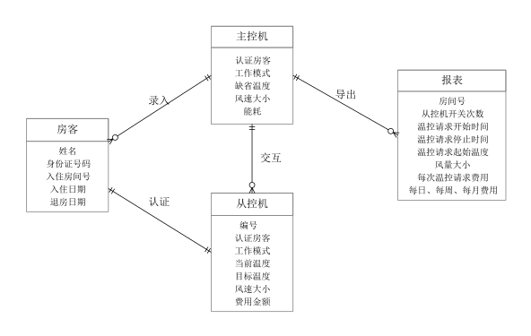

# 分布式温控系统结构化概要设计

> 2014211306 班 F 组
>
> 李俊宁 董星彤 张有杰 赵亮 左旭彤
>
> 2017 年 06 月 05 日

[heading-numbering]

## [toc-heading] [no-number] Table of Contents

[TOC]

## [no-number] 迭代历史

> - v0.1 | 2017/6/5 | John Lee | 创建文档
> - v0.2 | 2017/6/6 | 董星彤 | 更新各层数据流图，添加各子系统数据流图
> - v0.3 | 2017/6/6 | 董星彤 | 添加各子系统系统结构图
> - v0.4 | 2017/6/6 | 左旭彤 | 增加子系统5、6的处理说明和接口模块
> - v0.5 | 2017/6/7 | 董星彤 | 增加子系统1、2的处理说明和接口模块，增加系统级初始功能结构图
> - v0.6 | 2017/6/10 | 左旭彤 | 增加子系统3、4、7、8、9的处理说明和接口模块
> - v0.7 | 2017/6/10 | 赵亮 | 完成文档说明、项目背景说明、数据库的设计
> - v0.8 | 2017/6/11 | 董星彤 左旭彤 | 增加优化后的系统功能结构图
> - v0.9 | 2017/6/11 | 董星彤 左旭彤 | 修改处理说明和接口模块格式

## 文档说明
### 文档目的
该文档的主要目的是将分析分布式温控系统的结构，将该系统细分为各个功能相对独立的模块和子系统，
并对每个模块和子系统进行详细的描述和说明，完成结构化概要设计。

### 文档范围
围绕分布式温控系统展开，给出基于需求分析得到的各层数据流；
详细地描述各个模块和子系统的结构及功能，得出系统级的初始功能结构图和
优化后的结构图；最后完成数据库层面上的相关设计。

### 读者对象
软件设计人员、编码人员、测试人员等。

### 参考文档
- 《分布式温控系统用户需求说明书》
- 《用例模型说明书模板》
- 《分布式温控系统详细要求》

### 术语和缩写
见各个模块和子系统的详细说明

## 项目背景
根据如下需求，设计中央空调系统：
1. 空调系统由中央空调和房间空调（从控机）两部分构成。中央空调由特定的管理人员操控，房间空调由用户来操控。
2. 中央空调具备开关按钮，只可人工开启和关闭，正常开启后处于待机状态。有冷暖两种工作模式，每种模式有特定的缺省温度以及温度区间，可根据季节进行工作模式的调整。中央空调能够实时监测个房间的温度和状态，并且能够根据实时刷新的频率进行配置。
3. 从控机只能人工方式开闭，可以通过控制面板设置目标温度，目标温度有上下限制。控制面板的温度调节可以连续变化也可以断续变化。每个从控机内有一个温度传感器，可以实时监测房间的温度。
4. 从控机的控制面板能够发送高、中、低风速的请求，各小组可以自定义高、中、低三种风速下的温度变化值。中央空调可以根据从控机的请求时长及高中低风速的供风量计算每个房间所消耗的能量以及所需支付的金额，并将对应信息发送给每个从控机进行在线显示，以便客户查询。
5. 中央空调监控具备统计功能，可以根据需要给出日报表、周报表和月报表；报表内容如下：房间号、从控机开关机的次数、温控请求起止时间（列出所有记录）、温控请求的起止温度及风量大小（列出所有记录）、每次温控请求所需费用、每日（周、月）所需总费用。
6. 中央空调同时只能处理三台从控机的请求，为此主机要有负载均衡的能力。如果有超过三台从控机请求，则需要对所有请求机器进行调度，调度算法自行定义。

## 需求分析结果
### 第 0 层数据流图


### 第 1 层数据流图


### 第 2 层数据流图


## 基于功能需求的初始功能结构图
### 子系统1：调节子系统
#### 数据流图


#### 功能结构图


#### 功能模块说明

1. 模块名字 获取房间信息
  - 处理说明 “获取房间信息”模块可以获取信息，并将信息传递到主模块
  - 接口说明
    - PROCEDURE getRoominfo
    - INTERFACE RETURNS
    - TYPE Roominfo IS STRING
    - No external I/O or global data Used
    - Called by main
    - Calls no subordinate modules
2. 模块名字 获取主控机配置信息
  - 处理说明 “获取主控机配置信息”模块可以获取信息，并将信息传递到主模块
  - 接口说明
    - PROCEDURE getMconfigureinfo
    - INTERFACE RETURNS
    - TYPE Mconfigureinfo IS STRUCT
    - No external I/O or global data Used
    - Called by main
    - Calls no subordinate modules
3. 模块名字 获取调节请求记录
  - 处理说明 “获取调节请求记录”模块可以获取信息，并将信息传递到主模块
  - 接口说明
    - PROCEDURE getRequestRec
    - INTERFACE RETURNS
    - TYPE RequestRec IS STRUCT
    - No external I/O or global data Used
    - Called by main
    - Calls getAuth,getRequest,recvRequestInfo
4. 模块名字 获取使用授权
  - 处理说明 “获取使用授权”模块可以获取信息，并将信息传递到“获取调节请求模块”
  - 接口说明
    - PROCEDURE getAuth
    - INTERFACE RETURNS
    - TYPE Auth IS BOOL
    - No external I/O or global data Used
    - Called by getRequestRec
    - Calls no subordinate modules
5. 模块名字 获取调节请求
  - 处理说明 “获取调节请求”模块可以获取信息，并将信息传递到“获取调节请求记录模块”
  - 接口说明
    - PROCEDURE getRequest
    - INTERFACE RETURNS 
    - TYPE Request IS STRUCT
    - No external I/O or global data Used
    - Called by getRequestRec
    - Calls getTempSpeed,getSconfigureinfo,adjust
6. 模块名字 获取目标风速温度
  - 处理说明 “获取目标风速温度”模块可以获取信息，并将信息传递到“获取调节请求模块”
  - 接口说明
    - PROCEDURE getTempSpeed
    - INTERFACE RETURNS-
    - TYPE TempSpeed IS INTEGER
    - No external I/O or global data Used
    - Called by getRequest
    - Calls no subordinate modules
7. 模块名字 获取从控机配置信息
  - 处理说明 “获取从控机配置信息”模块可以获取信息，并将信息传递到“获取调节请求模块”
  - 接口说明
    - PROCEDURE getSconfigureinfo
    - INTERFACE RETURNS
    - TYPE Sconfigureinfo IS STRING
    - No external I/O or global data Used
    - Called by getRequest
    - Calls no subordinate modules
8. 模块名字 界面调节
  - 处理说明 “界面调节模块”获得从控机配置信息、目标温度和风速信息，并将他们转化为调节请求,将信息传递到“获取调节请求模块”
  - 接口说明
    - PROCEDURE adjust
    - INTERFACE ACCEPTS
    - TYPE information IS STRUCT
    - INTERFACE RETURNS
    - TYPE Request IS STRUCT
    - No external I/O or global data Used
    - Called by getRequest
    - Calls no subordinate modules
9. 模块名字 接收温度调节信息
  - 处理说明 “接收温度调节信息”获得从控机配置信息、目标温度和风速信息，并将他们转化为调节请求,将信息传递到“获取调节请求模块”
  - 接口说明
    - PROCEDURE recvRequestInfo
    - INTERFACE ACCEPTS
    - TYPE Auth IS BOOL
    - TYPE Request IS STRUCT
    - INTERFACE RETURNS
    - TYPE RequestRec IS STRUCT
    - No external I/O or global data Used
    - Called by getRequestRec
    - Calls no subordinate modules
10. 模块名字 负载均衡
   - 处理说明 “负载均衡”模块接收调解请求记录，主控机配置信息和房间信息，对空调请求做负载均衡处理，转化为空调运行状态和从控机及房间信息
   - 接口说明
     - PROCEDURE loadBalancing
     - INTERFACE ACCEPTS
     - TYPE Roominfo IS STRING
     - TYPE Mconfigureinfo IS STRUCT
     - TYPE RequestRec IS STRUCT
     - INTERFACE RETURNS
     - TYPE runningStatus IS STRUCT
     - TYPE slaveInfo IS STRUCT
     - No external I/O or global data Used
     - Called by main
     - Calls no subordinate modules
11. 模块名字 给出空调运行状态
  - 处理说明 “给出空调运行状态”从主模块获得空调运行状态，给出结果
  - 接口说明
    - PROCEDURE resultRunningStatus
    - INTERFACE ACCEPTS
    - TYPE runningStatus IS STRUCT
    - No external I/O or global data Used
    - Called by main
    - Calls no subordinate modules
12. 模块名字 给出从控机及房间信息
  - 处理说明 “给出从控机及房间信息”从主模块获得从控机及房间信息，给出结果
  - 接口说明
    - PROCEDURE resultSlaveInfo
    - INTERFACE ACCEPTS
    - TYPE slaveInfo IS STRUCT
	- No external I/O or global data Used
	- Called by main
	- Calls no subordinate modules
### 子系统2：报表管理子系统

#### 数据流图


#### 功能结构图


#### 功能模块说明

1. 模块名字 取得查询请求
  - 处理说明 “取得查询请求”模块可以获取信息，并将信息传递到主模块
  - 接口说明
    - PROCEDURE getSearchReq
    - INTERFACE RETURNS
    - TYPE SearchReq IS TIME
    - No external I/O or global data Used
    - Called by main
    - Calls no subordinate modules


2. 模块名字 获取报表
  - 处理说明 “获取报表”模块可以获取信息，并将信息传递到主模块
  - 接口说明
    - PROCEDURE getReport
    - INTERFACE RETURNS
    - TYPE Report IS STRUCT*
    - No external I/O or global data Used
    - Called by main
    - Calls getCost,getStartup,getRunningStatus,produceReport

3. 模块名字 获取能耗费用
  - 处理说明 “获取能耗费用”模块可以获取信息，并将信息传递到“获取报表模块”
  - 接口说明
    - PROCEDURE getCost
    - INTERFACE RETURNS
    - TYPE Cost IS DOUBLE
    - No external I/O or global data Used
    - Called by getReport
    - Calls no subordinate modules

4. 模块名字 获取从控机开机信息
  - 处理说明 “获取从控机开机信息”模块可以获取信息，并将信息传递到“获取报表模块”
  - 接口说明
    - PROCEDURE getStartup
    - INTERFACE RETURNS
    - TYPE Startup IS String
    - No external I/O or global data Used
    - Called by getReport
    - Calls no subordinate modules

5. 模块名字 获取空调运行状态
  - 处理说明 “获取空调运行状态”模块可以获取信息，并将信息传递到“获取调节请求模块”
  - 接口说明
    - PROCEDURE getRunningStatus
    - INTERFACE RETURNS
    - TYPE RunningStatus IS STRUCT
    - No external I/O or global data Used
    - Called by getReport
    - Calls no subordinate modules

6. 模块名字 生成报表
 - 处理说明 “接收温度调节信息”获得从控机配置信息、目标温度和风速信息，并将他们转化为调节请求,将信息传递到“获取调节请求模块”
 - 接口说明
   - PROCEDURE produceReport
   - INTERFACE ACCEPTS
   - TYPE Cost IS DOUBLE
   - TYPE Startup IS String
   - TYPE RunningStatus IS STRUCT
   - INTERFACE RETURNS
   - TYPE Report IS STRUCT *
   - No external I/O or global data Used
   - Called by getReport
   - Calls no subordinate modules

7. 模块名字 管理报表
 - 处理说明 “管理报表”模块接收报表和查询请求，根据查询请求查询报表，产生目标报表发送给主模块
 - 接口说明
   - PROCEDURE loadBalancing
   - INTERFACE ACCEPTS
   - TYPE Report IS STRUCT*
   - TYPE SearchReq IS TIME
   - INTERFACE RETURNS
   - TYPE targetReport IS STRUCT*
   - No external I/O or global data Used
   - Called by main
   - Calls no subordinate modules

8. 模块名字 给出目标报表
  - 处理说明 “给出目标报表”从主模块获得目标报表，给出结果
  - 接口说明
    - PROCEDURE resultTargetReport
    - INTERFACE ACCEPTS
    - TYPE targetReport IS STRUCT*
    - No external I/O or global data Used
    - Called by main
    - Calls no subordinate modules

### 子系统3：房间信息定时更新子系统

#### 数据流图


#### 功能结构图


#### 功能模块说明

1. 模块名字 获取房间信息
  - 处理说明 "获取房间信息"模块可以获取房间温度和从控机配置信息，然后将这些信息发给"发送房间信息"模块，同时获取来自"发送房间信息"模块的返回房间信息
  - 接口说明
    - PROCEDURE getroominfo
    - INTERFACE ACCEPTS
    - TYPE roomtemp IS STRING
    - TYPE Cconfigureinfo IS STRING
    - INTERFACE RETURNS
    - TYPE roominfo IS STRING
    - No external I/O or global data Used
    - Called by main
    - Calls getroomtemp,getCconfigureinfo and sendroominfo modules

2. 模块名字 获取房间温度
  - 处理说明 "获取房间温度"模块可以获取房间温度，并将其传给"获取房间信息"模块
  - 接口说明
    - PROCEDURE getroomtemp
    - INTERFACE RETURNS
    - TYPE roomtemp IS STRING
    - No external I/O or global data Used
    - Called by getroominfo
    - Calls no subordinate modules

3. 模块名字 获取从控机配置信息
  - 处理说明 "获取从控机配置信息"模块可以获取从控机配置信息，并将其传给"获取房间信息"模块
  - 接口说明
    - PROCEDURE getCconfigureinfo
    - INTERFACE RETURNS
    - TYPE Cconfigureinfo IS STRING
    - No external I/O or global data Used
    - Called by getroominfo
    - Calls no subordinate modules 
4. 模块名字 发送房间信息
  - 处理说明 "发送房间信息"模块接收来自"获取房间信息"模块的从控机配置信息和房间温度，并转化为房间信息返回给"获取房间信息"模块
  - 接口说明
    - PROCEDURE sendroominfo
    - INTERFACE ACCEPTS
    - TYPE Cconfigureinfo IS STRING
    - TYPE tempreture IS STRING
    - INTERFACE RETURNS
    - TYPE roominfo IS STRING
    - No external I/O or global data Used
    - Called by getroominfo
    - Calls no subordinate modules 
 5. 模块名字 房间信息更新
   - 处理说明 "房间信息更新"模块获取来自主模块的房间信息，并将之转化为目标房间信息返回给主模块
   - 接口说明
     - PROCEDURE updateroominfo
     - INTERFACE ACCEPTS
     - TYPE roominfo IS STRING
     - INTERFACE RETURNS
     - TYPE targetroominfo IS STRING
     - No external I/O or global data Used
     - Called by main
     - Calls no subordinate modules
 6. 模块名字 给出结果
   - 处理说明 "给出结果"模块接收来自主模块的目标房间信息，并给出结果
   - 接口说明
     - PROCEDURE giveresult
     - INTERFACE ACCEPTS
     - TYPE targetroominfo IS STRING
     - No external I/O or global data Used
     - Called by main
     - Calls no subordinate modules
### 子系统4：房客信息管理子系统

#### 数据流图


#### 功能结构图


#### 功能模块说明

1. 模块名字 取得数据
  - 处理说明 "取得数据"模块可以获得房客信息并将该信息返回主模块
  - 接口说明
    - PROCEDURE getdata
    - INTERFACE RETURNS
    - TYPE guestinfo IS STRING
    - No external I/O or global data Used
    - Called by main
    - Calls no subordinate modules
2. 模块名字 管理房客信息 
  - 处理说明 "管理房客信息"模块可以接收来自主模块的房客信息，并管理房客信息，及将他们返回给主模块
  - 接口说明
    - PROCEDURE manageinfo
    - INTERFACE ACCEPTS
    - TYPE guestinfo IS STRING
    - INTERFACE RETURNS
    - TYPE allguestinfo IS STRING
    - No external I/O or global data Used
    - Called by main
    - Calls no subordinate modules
3. 模块名字 给出结果
  - 处理说明 "给出结果"模块可以接收来自主模块的全部房客信息，并将之给出
  - 接口说明
    - PROCEDURE giveresult
    - INTERFACE ACCEPTS
    - TYPE allguestinfo IS STRING
    - No external I/O or global data Used
    - Called by main
    - Calls no subordinate modules


### 子系统5：实时信息查看子系统
#### 数据流图


#### 功能结构图


#### 功能模块说明

1. 模块名字 获取从控机及房间信息
  - 处理说明 “获取从控机及房间信息”模块可以获取信息，并将信息传递到主模块
  - 接口说明
    - PROCEDURE getClientinfoAndRoominfo
    - INTERFACE RETURNS
    - TYPE ClientinfoAndRoominfo IS STRING
    - No external I/O or global data Used
    - Called by main
    - Calls no subordinate modules
    
2. 模块名字 查看实时信息
  - 处理说明 “查看实时信息”模块获取来自主模块的从控机及房间信息，并将其转化为全部从控机及房间信息
  - 接口说明
    - PROCEDURE ViewingRealtimeInformation
    - INTERFACE ACCEPTS
    - TYPE ClientinfoAndRoominfo IS STRING
    - INTERFACE RETURNS
    - TYPE AllClientinfoAndRoominfo IS STRING
    - No external I/O or global data Used
    - Called by main
    - Calls no subordinate modules
3. 模块名字 显示结果
  - 处理说明 “显示结果”模块接收来自主模块的全部从控机房间信息，并将其进行显示
  - 接口说明
    - PROCEDURE showresult
    - INTERFACE ACCEPTS
    - TYPE AllClientinfoAndRoominfo IS STRING
    - No external I/O or global data Used
    - Called by main
    - Calls no subordinate modules

### 子系统6：配置空调参数子系统
#### 数据流图


#### 功能结构图

#### 功能模块说明
1. 模块名字 取得配置信息
  - 处理说明 “取得配置信息”模块可以获取信息，并将信息传递到主模块
  - 接口说明
    - PROCEDURE getconfigureinfo
    - INTERFACE RETURNS
    - TYPE configureinfo IS STRING
    - No external I/O or global data Used
    - Called by main
    - Calls no subordinate modules

2. 模块名字 配置空调参数
  - 处理说明 “配置空调参数”模块可以获取来自主模块的配置信息，并将其转化为主控机配置返回给主模块
  - 接口说明
    - PROCEDURE configureParameter
    - INTERFACE ACCEPTS
    - TYPE configureinfo IS STRING
    - INTERFACE RETURNS
    - TYPE Mconfigureinfo IS STRING
    - No external I/O or global data Used
    - Called by main
    - Calls no subordinate modules
3. 模块名字 给出结果
  - 处理说明 “给出结果”模块可以接收来自主控机的主控机配置信息，并将结果给出
  - 接口说明
    - PROCEDURE giveresult
    - INTERFACE ACCEPTS
    - TYPE Mconfigureinfo IS STRING
    - No external I/O or global data Used
    - Called by main
    - Calls no subordinate modules

### 子系统7：能耗费用计算子系统
#### 数据流图


#### 功能结构图


#### 功能模块说明
1. 模块名字 取得空调运行状态
  - 处理说明 "取得空调运行状态"模块可以获取空调运行状态，并将该信息传给主模块
  - 接口说明
    - PROCEDURE getrunstate
    - INTERFACE RETURNS
    - TYPE runstate IS STRING
    - No external I/O or global data Used
    - Called by main
    - Calls no subordinate modules

2. 模块名字 费用能耗计算
  - 处理说明 "费用能耗计算"模块可以接收来自主模块的空调运行状态信息，进行费用能耗计算，并将计算所得费用能耗返回给主模块
  - 接口说明
    - PROCEDURE computecost
    - INTERFACE ACCEPTS
    - TYPE runstate IS STRING
    - INTERFACE RETURNS
    - TYPE cost IS STRING
    - No external I/O or global data Used
    - Called by main
    - Calls no subordinate modules
3. 模块名字 给出结果
  - 处理说明 "给出结果"模块可以接收来自主控机的费用能耗，并将结果给出
  - 接口说明
    - PROCEDURE givere
    - INTERFACE ACCEPTS
    - TYPE cost IS STRING
    - No external I/O or global data Used
    - Called by main
    - Calls no subordinate modules
        
### 子系统8：从控机信息显示子系统
#### 数据流图


#### 功能结构图


#### 功能模块说明
1. 模块名字 取得数据
  - 处理说明 "取得数据"模块可以获得能耗费用、从控机配置信息和空调运行状态，并将该信息返回主模块
  - 接口说明
    - PROCEDURE getdata
    - INTERFACE RETURNS
    - TYPE cost,Cconfigureinfo,runstate IS STRING
    - No external I/O or global data Used
    - Called by main
    - Calls no subordinate modules 
2. 模块名字 显示信息
  - 处理说明 "显示信息"模块可以获得来自主模块的能耗费用、从控机配置信息和空调运行状态信息，并将它们转化为空调房间状态返回主模块
  - 接口说明
    - PROCEDURE showinfo
    - INTERFACE ACCEPTS
    - TYPE cost,Cconfigureinfo,runstate IS STRING
    - INTERFACE RETURNS
    - TYPE roomstate IS STRING
    - No external I/O or global data Used
    - Called by main
    - Calls no subordinate modules
 3. 模块名字 给出结果
   - 处理说明 "给出结果"模块接收来自主模块的空调房间状态，并给出结果
   - 接口说明
     - PROCEDURE giveresult
     - INTERFACE ACCEPTS
     - TYPE roomstate IS STRING
     - No external I/O or global data Used
     - Called by main
     - Calls no subordinate module
### 子系统9：从控机登录认证子系统
#### 数据流图


#### 功能结构图


1. 模块名字 取得数据
  - 处理说明 "取得数据"模块将获取的目标房客信息返回主模块
  - 接口说明
    - PROCEDURE getdata
    - INTERFACE RETURNS
    - TYPE targetroommateinfo IS STRING
    - No external I/O or global data Used
    - Called by main
    - Calls no subordinate modules 
2. 模块名字 获取登录信息
  - 处理说明 “获取登录信息”模块可以获取信息，并将信息传递到"获取身份认证信息"模块
  - 接口说明
    - PROCEDURE getlogoninfo
    - INTERFACE RETURNS
    - TYPE logoninfo IS STRING
    - No external I/O or global data Used
    - Called by getauthinfo
    - Calls no subordinate modules
 3. 模块名字 取得从控机配置信息
  - 处理说明 “取得从控机配置信息”模块可以获取从控机配置信息，并将信息传递到"获取身份认证信息"模块
  - 接口说明
    - PROCEDURE getCconfigureinfo
    - INTERFACE RETURNS
    - TYPE Cconfigureinfo IS STRING
    - No external I/O or global data Used
    - Called by getauthinfo
    - Calls no subordinate modules
 4. 模块名字 
  - 处理说明 “取得从控机配置信息”模块可以获取从控机配置信息和登录信息，并将身份认证信息返回到"获取身份认证信息"模块
  - 接口说明
    - PROCEDURE showinfo
    - INTERFACE ACCEPTS
    - TYPE cost,Cconfigureinfo,runstate IS STRING
    - INTERFACE RETURNS
    - TYPE roomstate IS STRING
    - No external I/O or global data Used
    - Called by main
    - Calls no subordinate modules
 5. 模块名字 获取身份认证信息
  - 处理说明 "获取身份认证信息"模块可以获取身份认证信息，并将之传递给主模块
  - 接口说明
    - PROCEDURE getauthinfo
    - INTERFACE ACCEPTS
    - TYPE logoninfo IS STRING
    - INTERFACE RETURNS
    - TYPE logoninfo IS STRING
    - No external I/O or global data Used
    - Called by main
    - Calls getlogoninfo,getCconfigureinfo modules
 6. 模块名字 房客登录认证
  - 处理说明 "房客登录认证"模块可以获取来自主模块的目标房客信息和身份认证信息，并在完成登录认证之后将从控机开机信息和使用授权返回主模块
  - 接口说明
    - PROCEDURE auth
    - INTERFACE ACCEPTS
    - TYPE targetroommateinfo,logoninfo IS STRING
    - INTERFACE RETURNS
    - TYPE Coninfo,useauth IS STRING
    - No external I/O or global data Used
    - Called by main
    - Calls no subordinate modules
 7. 模块名字 给出结果
   - 处理说明 "给出结果"模块接收来自主模块的从控机开机信息和使用授权，并给出结果
   - 接口说明
     - PROCEDURE giveresult
     - INTERFACE ACCEPTS
     - TYPE Coninfo,useauth IS STRING
     - No external I/O or global data Used
     - Called by main
     - Calls no subordinate module
## 系统级初始功能结构图


## 优化后的系统级功能结构图
减少一些模块的扇入扇出


## 数据设计
### 数据库设计
#### E-R图



#### 数据库表结构
##### 房客信息录入表
Table | getGuestInfo
--|--
Version | v1.0
Purpose | 获取房客信息并进行录入
Primary Key | guestID
Foreign Key | roomID
Index | guestID

Column | Type | Length | NULL | Illustration
--|--|--|--|--
guestID | string | 10 | not null | 房客身份证号
roomID | string | 10 | not null | 房间号

##### 主控机参数配置表
Table | masterInfo
--|--
Version | v1.0
Purpose | 设置主控机的相关参数
Primary Key | guestID
Foreign Key | NULL
Index | guestID

Column | Type | Length | NULL | Illustration
--|--|--|--|--
guestID | string | 10 | not null | 房客身份证号
roomID | string | 10 | not null | 房间号
currentTemp | double | 5 | not null | 获取从控机房间的当前温度
targetTemp | double | 5 | not null | 获取从控机目标温度
wind | int | 5 | not null | 获取风速大小
energy | double | 10 | not null | 反馈能耗
cost | double | 10 | not null | 反馈费用消耗

##### 从控机参数配置表
Table | slaveInfo
--|--
Version | v1.0
Purpose | 配置从控机的相关参数
Primary Key | guestID
Foreign Key | NULL
Index | guestID

Column | Type | Length | NULL | Illustration
--|--|--|--|--
guestID | string | 10 | not null | 房客身份证号
currentTemp | double | 5 | not null | 从控机房间的当前温度
targetTemp | double | 5 | not null | 发送目标温度请求
wind | int | 5 | not null | 发送风速大小请求
energy | double | 10 | not null | 获取能耗
cost | double | 10 | not null | 获取费用消耗

##### 报表
Table | log
--|--
Version | v1.0
Purpose | 打印报表
Primary Key | roomID
Foreign Key | NULL
Index | roomID

Column | Type | Length | NULL | Illustration
--|--|--|--|--
roomID | string | 10 | not null | 房间号
wind | int | 5 | not null | 风速大小
tempBeg | double | 5 | not null | 当前温度
tempEnd | double | 5 | not null | 目标温度
timeBeg | double | 5 | not null | 温控请求开始时间
timeBeg | double | 5 | not null | 温控请求结束时间
cost | double | 10 | not null | 费用

#### 数据表关系


### 全局数据结构设计
#### 变量说明

``` cpp
    using RoomId = std::string;
    using GuestId = std::string;

    using Temperature = double;
    using Wind = int;  // Stop, Weak, Mid, Strong = 0, 1, 2, 3
    using Energy = double;
    using Cost = double;

    using WorkingMode = int; // Summer, Winter = 0, 1
    using PulseFreq = int;  // in second
```

- RoomID 房间号
- GuestID 房客身份证号
- Temperature 温度
- Wind 风速
- Energy 能耗
- Cost 费用
- WorkingMode 工作模式，分为冬季和夏季两种模式
- PulseFreq 脉冲频率

#### 数据结构说明
 - 房客信息录入，包括房间号和房客身份证号
``` cpp
    struct GuestInfo
    {
        RoomId room;
        GuestId guest;
    };
```

 - 房间信息，包括房间号和当前温度
```cpp
    struct RoomInfo
    {
        RoomId room;
        Temperature temp;
    };
```

 - 房间请求信息，包括房间号，温度请求及风速请求
```cpp
    struct RoomRequest
    {
        RoomId room;
        Temperature temp;
        Wind wind;
    };
```

 - 从控机客户端信息，包括是否送风，能耗和费用
```cpp
    struct ClientInfo
    {
        bool hasWind;
        Energy energy;
        Cost cost;
    };
```

 - 主控机服务器信息，包括是够开关状态，工作模式和脉冲频率
```cpp
    struct ServerInfo
    {
        bool isOn = false;
        WorkingMode mode = 0;
        PulseFreq pulseFreq = 1;
    };
```

 - 从控机开关次数
```cpp
    struct LogOnOff
    {
        RoomId room;
        TimePoint timeBeg, timeEnd;
    };
```

 - 报表信息，包括房间号，风速大小，温控请求开始结束时间，当前温度，目标温度，能耗等
```cpp
    struct LogRequest
    {
        RoomId room;
        Wind wind;
        Temperature tempBeg, tempEnd;
        TimePoint timeBeg, timeEnd;
        Cost cost;
    };
```

 - 从控机状态信息，包括房客ID，当前温度，目标温度，风速大小，能耗费用等
```cpp
    struct ClientState
    {
        GuestId guest;
        Temperature curTemp;
        Temperature targetTemp;
        Wind wind;
        Energy energy;
        Cost cost;
    };
```