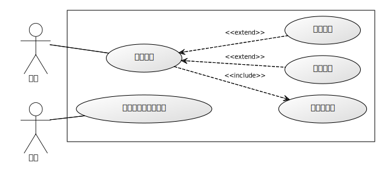
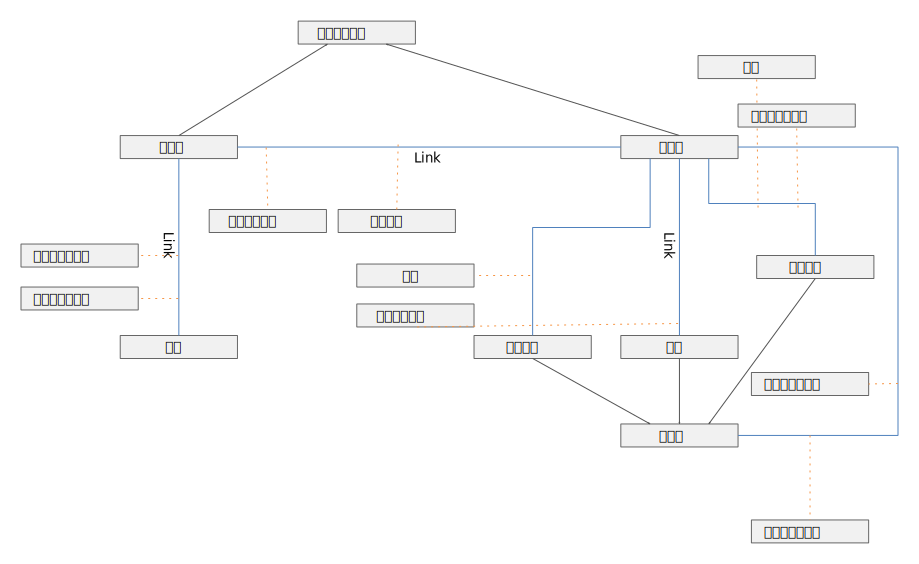
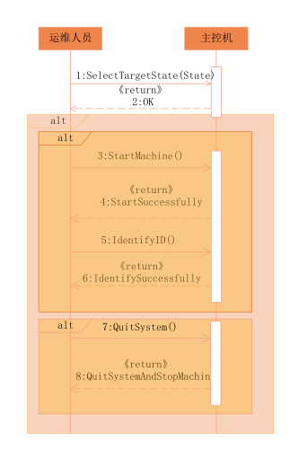
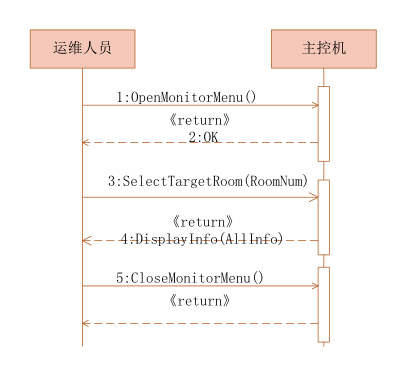
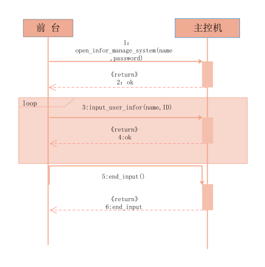
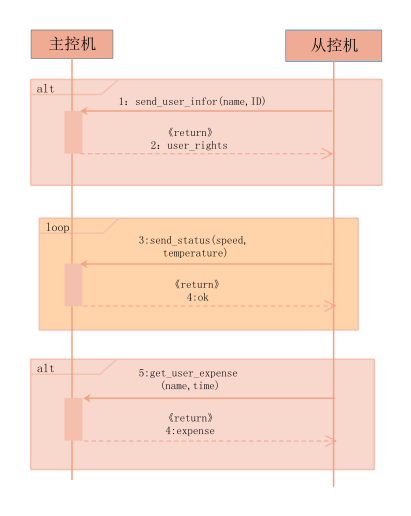
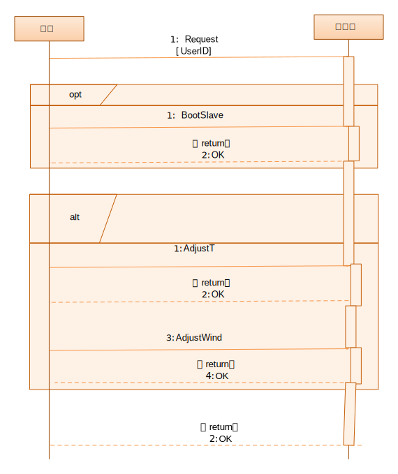
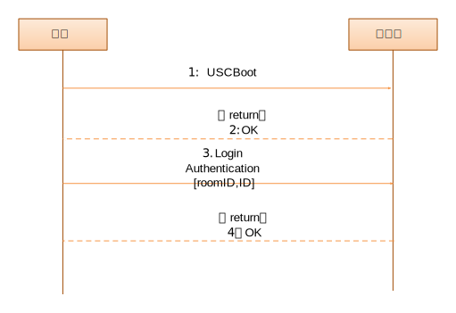

# 分布式温控系统用例模型说明书

> 2014211306 班 F 组
>
> 李俊宁 董星彤 张有杰 赵亮 左旭彤
>
> 2017 年 04 月 28 日

## Table of Contents

[TOC]

[page-break]

## 迭代历史

> - v0.1 | 2017/4/17 | John Lee | 创建文档
> - v0.2 | 2017/4/17 | 张有杰 | 完成主控机用例描述部分
> - v0.3 | 2017/4/18 | 赵亮 | 完成文档介绍、项目背景
> - v0.4 | 2017/4/18 | 左旭彤 董星彤 | 完成从控机用例描述部分
> - v0.5 | 2017/4/18 | John Lee | 添加用例图
> - v0.6 | 2017/4/18 | 张有杰   | 完成主控机用例描述部分编号修正
> - v0.7 | 2017/4/19 | 董星彤 | 修改从控机用例格式
> - v0.8 | 2017/4/19 | 左旭彤 | 修改从控机用例格式
> - v1.0 | 2017/4/19 | John Lee | 发布文档
> - v1.1 | 2017/4/25 | 左旭彤 | 修改从控机用例
> - v1.2 | 2017/4/25 | 董星彤 | 修改用例图
> - v1.3 | 2017/4/26 | 董星彤 | 主控机用例：添加认证房客身份用例，修改主控机财务人员的管理报表，导出报表，统计费用用例和从控机获取信息用例，删除停止送风用例
> - v1.4 | 2017/4/26 | 左旭彤 | 主控机用例：添加前台维护房客信息用例，修改从控机获取信息用例
> - v1.5 | 2017/4/26 | 左旭彤 | 从控机用例：修改控制空调，改变温度用例
> - v1.6 | 2017/4/26 | 董星彤 | 增加主控机：管理报表，从控机调控系统顺序图
> - v1.7 | 2017/4/26 | 左旭彤 | 修改从控机用例，增加从控机系统顺序图
> - v1.8 | 2017/4/26 | 董星彤 左旭彤 | 增加从控机和部分主控机操作契约
> - v1.9 | 2017/4/26 | 张有杰 | 调整并完善主控机部分系统顺序图以及对应操作契约
> - v1.10 | 2017/4/27 | 赵  亮 | 调整并完善主控机部分系统顺序图以及对应操作契约
> - v1.11 | 2017/4/27 | 董星彤 | 修改用例图
> - v1.12 | 2017/4/27 | 董星彤 | 增加领域模型
> - v1.13 | 2017/4/27 | 左旭彤 | 修改领域模型
> - v2.0 | 2017/4/28 | John Lee | 发布文档

[page-break]

## 1. 文档介绍

### 1.1 文档目的

该文档主要的目的建立用例模型。
根据已经确定的需求分析来描述用户以及各个子功能系统之间的交互场景，
对每一个场景建立相应的用例模型，
软件开发人员根据此模型来进行软件的详细设计与开发。

### 1.2 文档范围

围绕分布式温控系统展开，
详细地描述分布式温控系统的用例图、用例说明、领域模型以及系统操作契约等。
通过用例图构建出所有可能用例与各个参与者之间的框架结构关系，
然后对每一个交互场景进行详细描述和分析。

### 1.3 读者对象

用户、设计人员、编码人员和测试人员等

### 1.4 参考文献

- 《分布式温控系统用户需求说明书》
- 《用例模型说明书模板》
- 《分布式温控系统详细要求》

### 1.5 术语与缩写解释

| 术语 | 解释 |
|--|--|
| UC_M | 主控机的用例模型 |
| UC_S | 从控机的用例模型 |

## 2. 项目背景

根据如下需求，设计中央空调系统：

1. 空调系统由中央空调和房间空调（从控机）两部分构成。中央空调由特定的管理人员操控，房间空调由用户来操控。
2. 中央空调具备开关按钮，只可人工开启和关闭，正常开启后处于待机状态。有冷暖两种工作模式，每种模式有特定的缺省温度以及温度区间，可根据季节进行工作模式的调整。中央空调能够实时监测个房间的温度和状态，并且能够根据实时刷新的频率进行配置。
3. 从控机只能人工方式开闭，可以通过控制面板设置目标温度，目标温度有上下限制。控制面板的温度调节可以连续变化也可以断续变化。每个从控机内有一个温度传感器，可以实时监测房间的温度。
4. 从控机的控制面板能够发送高、中、低风速的请求，各小组可以自定义高、中、低三种风速下的温度变化值。中央空调可以根据从控机的请求时长及高中低风速的供风量计算每个房间所消耗的能量以及所需支付的金额，并将对应信息发送给每个从控机进行在线显示，以便客户查询。
5. 中央空调监控具备统计功能，可以根据需要给出日报表、周报表和月报表；报表内容如下：房间号、从控机开关机的次数、温控请求起止时间（列出所有记录）、温控请求的起止温度及风量大小（列出所有记录）、每次温控请求所需费用、每日（周、月）所需总费用。
6. 中央空调同时只能处理三台从控机的请求，为此主机要有负载均衡的能力。如果有超过三台从控机请求，则需要对所有请求机器进行调度，调度算法自行定义。

## 3. 用例图

### 3.1 主控机用例图

[page-break]

### 3.2 从控机用例图

## 4. 用例说明

### 4.1 主控机用例描述

#### 4.1.1 主控机 001 用例描述

| 用例编号 | UC_M_001 |
| :-- | :-- |
| 用例名称 | 运行状态切换 |
| 范围 | 主控机 |
| 级别 | 用户目标级别 |
| 主要参与者 | 运维人员 |
| 项目相关人员及其兴趣 | 运维人员:完成开、关机状态之间的切换 |
| 前置条件 | 主控机系统正常无故障 |
| 后置条件 | 主控机系统切换状态 |
| 主要成功场景 | 1. 运维人员选择目标切换状态 | 
| | 2. 系统成功完成想目标状态的切换，用例结束。|
| 扩展（或替代流程) | \*a. 任何时刻，系统停电或硬件不正常记录日志，系统关闭。管理人员重启系统。 |
| | 1a. 运维人员开启主控机系统,转入扩展用例: 主控机开机 UC_M_001_1 |
| | 1b. 运维人员关闭主控机系统,转入扩展用例: 主控机关机 UC_M_001_2 |
| 特殊需求 | 无 |
| 发生频率 | 运维人员切换主控机运行状态时|

##### 4.1.1.1 主控机 001_1 用例描述

| 用例编号 | UC_M_001_1 |
| :-- | :-- |
| 用例名称 | 主控机开机 |
| 范围 | 主控机 |
| 级别 | 子功能级别 |
| 主要参与者 | 运维人员 |
| 项目相关人员及其兴趣 | 运维人员:成功打开主控机，使其保持待机状态。|
| 前置条件 | 主控机系统处于关机状态 |
| 后置条件 | 主控机系统成功开机，进入待机状态 |
| 主要成功场景|1. 运维人员手动按下开机按钮 |
| | 2. 运维人员成功验证身份 |
| | 3. 主控机成功开机，进入管理界面，用例结束 |
| 扩展（或替代流程)|\*a 任何时刻，系统停电或硬件不正常,记录日志，系统关闭。管理人员重启系统，系统重新进入成功场景 1 |
| | 2a. 运维人员验证身份失败，用户名或密码错误，重新验证身份，系统重新进入成功场景 1 |
| | 2b. 失败次数超过三次，主控机系统锁定。运维人员重启系统，系统重新进入成功场景 1 |
| | 2c. 主机系统锁定。使用预设PIN码解锁系统，重新设置运维人员账户密码，返回成功场景 1  |
| 特殊需求 | 无 |
| 发生频率 | 运维人员打开主控机时使用|

##### 4.1.1.2 主控机 001_2 用例描述

| 用例编号 | UC_M_001_2 |
| :-- | :-- |
| 用例名称 | 主控机关机 |
| 范围 | 主控机 |
| 级别 | 子功能级别 |
| 主要参与者 | 运维人员 |
| 项目相关人员及其兴趣 | 运维人员:关闭主控机。|
| 前置条件 | 主控机系统处于开机状态 | 
| 后置条件 | 主控机系统成功关机。|
| 主要成功场景 | 1. 运维人员点击关机按钮 |
| | 2. 系统停止所有监控及温控服务，记录日志 |
| | 3. 系统向所有从机发送关机信息 |
| | 4. 主控机系统成功关机，用例结束 |
| 扩展（或替代流程) | 无 |
| 特殊需求 | 无 |
| 发生频率 | 运维人员关闭主控机时使用 |

#### 4.1.2 主控机 002 用例描述

|  用例编号 | UC_M_002 |
| :-- | :-- |
|  用例名称 | 选项配置更改 |
|  范围 | 主控机 |
|  级别 | 用户目标级别 |
|  主要参与者 | 运维人员 |
|  项目相关人员及其兴趣 | 运维人员:对系统选项及参数进行配置 |
|  前置条件 | 主控机系统处于开机状态，正常运行 |
|  后置条件 | 主控机配置修改成功 |
|  主要成功场景 | 1. 运维人员打开配置管理界面 |
| | 2. 运维人员选择想要更改的配置选项 |
| | 3. 运维人员输入新的参数选项并提交 |
| | 4. 系统完成新参数选项的配置，用例结束 |
| 扩展（或替代流程)|2a.运维人员选择工作模式的配置。切换主控机供暖、制冷的工作模式 |
| | 2b. 调节不同风速的收费标准 |
| | 2c. 调整使用不同的负载均衡策略 |
| | 2d. 从控机心跳频率设置 |
| | 2e. 系统配置按默认值初始化 |
| 特殊需求 | 无 |
| 发生频率 | 运维人员更改系统配置时使用 |

#### 4.1.3 主控机 003 用例描述

|  用例编号 | UC_M_003 |
| :-- | :-- |
|  用例名称 | 监测从控机状态 |
|  范围 | 主控机 |
|  级别 | 用户目标级别 |
|  主要参与者 | 运维人员 |
|  项目相关人员及其兴趣 | 运维人员:对从控机状态进行监测 |
|  前置条件 | 主控机系统处于开机状态，正常运行 |
|  后置条件 | 从控机状态监测成果 |
|  主要成功场景 | 1. 运维人员打开从控机状态查看界面 |
| | 2. 运维人员选择想要查看的房间号 |
| | 3. 主控机系统显示从控机目标温度及设置风速 |
| | 4. 主控机系统显示从控机当前温度 |
| | 5. 从控机状态监测成果，用例结束 |
| 扩展（或替代流程)|*a.系统显示状态异常，运维人员排查异常维护系统 |
| 特殊需求 | 无 |
| 发生频率 | 运维人员监测从控机状态 |

#### 4.1.4 主控机 004 用例描述

| 用例编号 | UC_M_004 |
| :-- | :-- |
| 用例名称 | 管理报表 |
| 范围 | 主控机 |
| 级别 | 用户目标级用例 |
| 主要参与者 | 财务人员 |
| 项目相关人员及其兴趣 | 运维人员:对报表进行管理 |
| 前置条件 | 系统正常运行 |
| 后置条件 | 财务人员成功完成报表管理 |
| 主要成功场景 | 1. 财务人员打开报表管理界面 |
| | 2. 财务人员选择目标报表选项，如日期、时间段、用户、房间号等 |
| | 3. 验证报表信息合法，成功查询 |
| | 4. 系统显示相应的报表 |
| | 5. 完成报表管理，用例结束 |
| 扩展（或替代流程) | 3a. 报表选项不合法，返回成功场景 2 ，重新输入 |
| | 4a. 选择报表导入导出选项，进入扩展用例: 报表导出 UC_M_003_1 |                    
| 特殊需求 | 系统可以以图表等方式灵活显示报表统计信息 |
| 发生频率 | 管理员管理报表时 |

##### 4.1.4.1 主控机 004_1 用例描述

| 用例编号 | UC_M_004_1 |
| :-- | :-- |
| 用例名称 | 导出报表 |
| 范围 | 主控机 |
| 级别 | 子用例级别 |
| 主要参与者 | 财务人员 |
| 项目相关人员及其兴趣 | 财务人员:对主控机报表进行导出 |
| 前置条件 | 系统进入报表管理界面 |
| 后置条件 | 主控机成功管理报表 |
| 主要成功场景 | 1. 管理员选择导出选项 |
| | 2. 进行报表导出，用例结束 |
| 扩展（或替代流程) | 2a. 选择打印报表，系统连接外设，打印报表数据 |
| | 2b. 选择导出报表，选择报表导出位置及文件类型，完成报表数据导出 |      
| 特殊需求 | 系统在导出报表时对不同的数据库文件应具有兼容性 |
| | 系统打印报表时应可以选择具体的打印选项，如选择纸张大小等 |
| 发生频率 | 管理员需要导入及导出报表内容时 |

#### 4.1.5 主控机 005 用例描述

| 用例编号 | UC_M_005 |
| :-- | :-- |
| 用例名称 | 维护房客信息 |
| 范围 | 主控机 |
| 级别 | 用户目标级别 |
| 主要参与者 | 前台 |
| 项目相关人员及其兴趣 | 前台:进行新入住用户信息录入，修改房客空调使用权限 |
| 前置条件 | 系统正常运行 |
| 后置条件 | 前台完成新入住用户的信息录入，新入住房客被允许使用空调，离开用户权限修改为不允许使用空调 |
| 主要成功场景 | 1. 前台点开房客信息管理界面 |
| | 2. 前台进行信息管理，用例结束 |
| 扩展（或替代流程) | 2a. 如果有新用户入住，完成新房客信息录入并修改用户权限为可以使用空调 |
| | 2b. 如果有房客离开，修改用户使用权限为禁止使用空调 |
| 特殊需求 | 酒店管理人员可以查看房客信息 |
| 发生频率 | 房客入住或者离开时 |

#### 4.1.6 主控机 006 用例描述

| 用例编号 | UC_M_006 |
| :-- | :-- |
| 用例名称 | 获取信息 |
| 范围 | 主控机 |
| 级别 | 用户目标级别 |
| 主要参与者 | 从控机、主控机 |
| 项目相关人员及其兴趣 | 从控机：获取从控机的耗能、计费情况、风速及主控机状态  主控机：获取用户信息，房间信息和从控机使用时间 |
| 前置条件 | 系统正常运行 |
| 后置条件 | 主控机和从控机之间完成信息交互 |
| 主要成功场景 | 1. 从控机向主控机周期性发出用户信息和房间信息和从控机使用信息 |
| | 2. 主控机利用时间计算费用，转包含用例，统计能耗费用：UC_M_005_2 |
| | 3. 从控机接收到主控机返回的从控机的耗能、计费情况、风速及主控机状态 |
| | 4. 从控机将所获取的信息显示在控制面板上 | 
| | 5. 信息交互成功，用例结束 |
| 扩展（或替代流程) | 1a.信息中包含新用户信息，转扩展用例：认证房客身份 UC_M_005_1 |
| | 1b. 信息中的房间温度和用户设定温度相同，主控机停止向房间送风，返回场景 2 |
| 特殊需求 | 从控机可以采用图表、数字等方式结合，清晰显示查询结果  主控机应能够监测出从控机的异常情况，比如长时间超低温、高温运转等 |
| 发生频率 | 周期性交互信息 |

##### 4.1.6.1 主控机 006_1 用例描述

| 用例编号 | UC_M_006_1 |
| :-- | :-- |
| 用例名称 | 认证房客身份 |
| 范围 | 主控机子系统 |
| 级别 | 用户目标级别 |
| 主要参与者 | 从控机 |
| 项目相关人员及其兴趣 | 从控机:发送房客身份认证信息请求登录 |
| 前置条件 | 主控机正常运行并成功录入房客身份信息，修改房客权限 |
| 后置条件 | 成功认证房客身份信息 |
| 主要成功场景 | 1. 从控机向主控机发送房客的房间号和身份证号 |
| | 2. 主控机验证收到的房客身份信息，查看房客权限 |
| | 3. 主控机验证房客身份信息成功，向从控机发送验证成功信息，用例结束 |
| 扩展（或替代流程) | 3a. 主控机未在数据库中查找到房客身份信息，向从控机发送验证失败信息，用例结束 |
| | 3b. 主控机在数据库中查找到房客身份信息，但房客权限不足，向从控机发送验证失败信息，用例结束 |
| 特殊需求 | 无 |
| 发生频率 | 从控机发送身份验证请求 |

##### 4.1.6.2 主控机 006_2 用例描述

| 用例编号 | UC_M_006_2 |
| :-- | :-- |
| 用例名称 | 统计能耗费用 |
| 范围 | 主控机 |
| 级别 | 子功能级别 |
| 主要参与者 | 从控机 |    
| 项目相关人员及其兴趣 | 从控机:向主控机汇报房间空调状态，获取费用能量统计 |
| 前置条件 | 系统正常运行，监测各房间状态 |
| 后置条件 | 主控机实时统计费用 |
| 主要成功场景 | 1. 主控机获取房间空调的风速和运行时间，计算房间能耗 |
| |  2. 主控机根据能耗计算费用，用例结束 |
| 扩展（或替代流程) | 无 |
| 特殊需求 | 主控机应能够监测出从控机的异常情况，比如费用异常增多，能耗过大等。 |
| 发生频率 | 从控机开启，并发出温控请求后。 |

#### 4.1.7 主控机 007 用例描述

| 用例编号 | UC_M_007 |
| :-- | :-- |
| 用例名称 | 从控机调控 |
| 范围 | 主控机 |
| 级别 | 用户目标级别 |
| 主要参与者 | 从控机 |
| 项目相关人员及其兴趣 | 从控机:向主控机发出调控请求 |
| 前置条件 | 主控机正常送风 |
| 后置条件 | 主控机响应请求，进行温控 |
| 主要成功场景 | 1. 从控机向主控机发出温控请求 |
| | 2. 主控机收到温控请求，进行调控 |
| | 3. 主控机响应温控请求，用例结束 |
| 扩展（或替代流程) | 1a. 从控机发出目标温度调节请求，转入扩展用例: 调节温度请求 UC_M_006_1 |
| | 1b. 从控机发出风速调节请求，转入扩展用例: 调节风速请求 UC_M_006_2 |
| | 1c. 从控机发出停止送风请求，主控机停止停止送风 |
| 特殊需求 | 面对时间间隔过低的来自同一从控机的请求，主控机只响应最后一次请求。 |
| | 主控机对从控机请求的接受时间应在可接受的范围内，如1s。|
| 发生频率 | 用户使用从控机发出调控请求 |

##### 4.1.7.1 主控机 007_1 用例描述

| 用例编号 | UC_M_007_1 |
| :-- | :-- |
| 用例名称 | 调节温度请求 |
| 范围 | 主控机 |
| 级别 | 子功能级别 |
| 主要参与者 | 从控机 |
| 项目相关人员及其兴趣 | 从控机:向主控机发出调节目标温度的请求 
| | 主控机:接受从机调节请求，并返回确认信息 |
| 前置条件 | 主控机正常送风，从机正常运行 |
| 后置条件 | 主控机响应请求，成功调整从控机目标温度，并向从机发出确认信息 |
| 主要成功场景 | 1. 从控机向主控机发出调节温度的请求 |
| | 2. 主控机收到温控请求，进行目标温度的调整 |
| | 3. 主控机成功响应温度调整请求，用例结束 |
| 扩展（或替代流程) | 2a.若目标温度与主控机工作模式对应的温度范围矛盾，报告错误信息，响应从控机 |
| | 2b. 目标温度处于主控机工作模式对应的温度范围内，转入成功场景 3 |
| | 3a. 若当前从控机数目超过主控机负载能力，从控机请求服从主控机负载均衡策略 |
| | 3b. 主控机立刻相应从控机请求 |
| 特殊需求 | 主控机对从控机请求的接受时间应在可接受的范围内，如1s |
| 发生频率 | 用户使用从控机调节温度 |

##### 4.1.7.2 主控机 007_2 用例描述

| 用例编号 | UC_M_007_2 |
| :-- | :-- |
| 用例名称 | 调节风速请求
| 范围 | 主控机 |
| 级别 | 子功能级别 |
| 主要参与者 | 从控机 |
| 项目相关人员及其兴趣 | 从控机:向主控机发出调整风速的请求 |
| | 主控机:接受从机调节请求，并返回确认信息 |
| 前置条件 | 主控机正常送风，从机正常运行 |
| 后置条件 | 主控机响应请求，调整分配给从控机的风速，并向从机发出确认信息 |
| 主要成功场景 | 1. 从控机向主控机发出风速调整请求 |
| | 2. 主控机收到风控请求，进行风速调整 |
| | 3. 主控机成功响应风控请求，向从控机返回确认信息，用例结束 |
| 扩展（或替代流程) | 1a. 从控机发送请求时已达到目标温度并停止送风，主控机发送“等待”响应 |
| | 1b. 从控机实际温度与目标温度相差 1℃ 时，再次响应从控机请求，开始送风。|
| | 1c. 从控机温度未达到目标温度，主控机确认从控机请求 |
| 特殊需求 | 主控机对从控机请求的接受时间应在可接受的范围内，如 1s |
| 发生频率 | 用户使用从控机调节风速 |
  

### 4.2 从控机用例描述

#### 4.2.1 从控机001用例描述

| 用例编号 | UC_S_001 |
| :-- | :-- |
| 用例名称 | 控制空调 |
| 范围 | 分布式中央空调控制系统从控机子系统 |
| 级别 | 用户目标级别 |
| 主要参与者 | 最终用户 |
| 项目相关人员及其兴趣 | 最终用户：调节从控机子系统 从控机子系统：接受或拒绝请求
| 前置条件 | 主控机已经被人工开启，用户去操作控制面板
| 后置条件 | 用户完成对温度的调节控制
| 主要成功场景  | 1. 用户请求使用控制面板控制温度 |
| | 2. 如果之前此房间用户未有请求，转扩展用例：启动从控机 US_S_001_1 |
| | 3. 如果用户点击温度调节按钮，转扩展用例：改变温度 US_S_001_2
| | 4. 如果用户点击风速调节按钮，转扩展用例：改变风速 US_S_001_3
| | 5. 温度控制完成，用例结束 |
| 扩展（或替代流程) | *a 停电，等待来电 |
| | *b. 系统崩溃，等待系统管理员处理突发事件 |
| | 1a. 用户请求关闭从控机 |
| 特殊需求 | 无 |
| 发生频率 | 用户每次使用从控机时启动

##### 4.2.1.1 从控机001_1用例描述

| 用例编号 | UC_S_001_1
| :-- | :-- |
| 用例名称 | 启动从控机
| 范围 | 分布式中央空调控制系统从控机子系统
| 级别 | 子系统目标级别
| 主要参与者 | 最终用户
| 项目相关人员及其兴趣 | 最终用户：启动从控机子系统 从控机子系统：接受或拒绝请求
| 前置条件 | 主控机已经被人工开启并开始工作,从控机未被打开，用户去操作控制面板
| 后置条件 | 用户成功登陆系统并启动从控机
| 主要成功场景 | 1. 用户要求启动从控机并点击开机键
| | 2. 从控机开机，与中央空调完成连接认证
| | 3. 用户输入房间号+身份证号
| | 4. 用户登录成功,开机完成，用例结束
| 扩展（或替代流程) | *a. 停电，等待来电
| | *b. 系统崩溃，等待系统管理员处理突发事件
| 特殊需求 | 无
| 发生频率 | 用户开启从控机

##### 4.2.1.2 从控机001_2用例描述

| 用例编号 | UC_S_001_2|
|:--|:--|
| 用例名称 | 改变温度 |
| 范围 | 分布式中央空调控制系统从控机子系统 |
| 级别 | 子系统目标级别 |
| 主要参与者 | 最终用户 |
| 项目相关人员及其兴趣 | 最终用户：调节空调温度，从控机子系统：接受或拒绝请求
| 前置条件 | 主控机已经被人工开启并开始工作，从控机被打开，用户去操作控制面板
| 后置条件 | 温度改变设置成功，从控机面板显示当前设置温度
| 主要成功场景 | 1. 用户请求上下调节温度
| | 2. 用户按动温度调节按钮       
| | 3. 系统接收调节的指令，调节成功，用例结束
| 扩展（或替代流程) | *a. 停电，等待来电
| | *b. 系统崩溃，等待系统管理员处理突发事件
| | 1a. 用户请求调节温度，但是从控机没有响应：等待系统管理员处理
| | 2a. 用户调节温度时，请求的温度超过了合理范围（供暖温度25°C～30°C，制冷温度18°C～25°C）
| | 2b. 若用户按动温度调节按钮连续两次或多次指令的时间间隔小于1s，系统接收最后一次调节指令，转到成功场景3
| | 2c. 若用户按动温度调节按钮连续两次或多次指令的时间间隔大于1s，系统接收所有调节指令，转到成功场景3
| 特殊需求 | 无
| 发生频率 | 用户调节温度时开启

##### 4.2.1.3 从控机001_3用例描述

| 用例编号 | UC_S_001_3 |
|:--|:--|
| 用例名称 | 调节风速 |
| 范围 | 分布式中央空调控制系统从控机子系统 |
| 级别 | 子系统目标级别 |
| 主要参与者 | 最终用户 |
| 项目相关人员及其兴趣 | 最终用户：调节空调风速，从控机子系统：接受或拒绝请求
| 前置条件 | 中央空调主控机处于开启状态，中央空调从控机处于开启状态，用户登陆成功
| 后置条件 | 用户完成对风速的调节，从控机面板显示当前风速
| 主要成功场景 | 1. 用户请求使用控制面板调节风速
| | 2. 用户按动风速调节按钮
| | 3. 系统接收调节的指令，调节成功，用例结束
| 扩展（或替代流程) | *a. 停电，等待来电
| | *b. 系统崩溃，等待系统管理员处理突发事件
| | 2b. 若用户按动温度调节按钮连续两次或多次指令的时间间隔小于1s，系统接收最后一次调节指令，转到成功场景3
| | 2c. 若用户按动温度调节按钮连续两次或多次指令的时间间隔大于1s，系统接收所有调节指令，转到成功场景3
| | 3a. 用户选择了与当前风速相同的风速，子系统检测到请求风速与当前风速相同，不予理会，风速调节失败，用例结束
| | 3b. 用户选择了与当前风速不同的风速，主控机系统检测到房间温度与设定目标温度相同，不给该房间送风，风速调节失败，用例结束
| | 3c. 用户选择了与当前风速不同的风速，主控机系统目前处于负载均衡状态，不给该房间送风或固定送某种风，风速调节失败，用例结束
| 特殊需求 | 无
| 发生频率 | 用户调节风速时开启

#### 4.2.2 从控机002用例描述

| 用例编号 | UC_S_002 |
|:--|:--|
| 用例名称 | 触发从控机子系统的自动更新功能 |
| 范围 | 分布式中央空调控制系统从控机子系统 |
| 级别 | 用户目标级别 |
| 主要参与者 | 计时器（时钟）|
| 项目相关人员及其兴趣 | 时钟：周期性发送脉冲出发从控机子系统自动更新
| 前置条件 | 中央空调主控机处于开启状态，中央空调从控机处于开启状态，用户登陆成功
| 后置条件 | 从控机更新显示的中央空调工作模式，工作温度，能量消耗和金额等信息
| 主要成功场景 | 1. 计时器周期性地向从控机系统发送脉冲，触发从控机子系统的自动更新功能
| 扩展（或替代流程) | *a. 停电，等待来电
| | *b. 系统崩溃，等待系统管理员处理突发事件
| | *c. 时钟在任意时刻发送脉冲失败，等待系统重启
| 特殊需求 | 无 |
| 发生频率 | 每隔周期 T 发生

## 5. 领域模型

[page-break]

## 6. 系统顺序图

### 6.1 主控机系统顺序图

#### 6.1.1 用例UC_M_001系统顺序图

[img=max-width:80%]

[align-center]

[page-break]

#### 6.1.2 用例UC_M_002系统顺序图

[img=max-width:80%]

[align-center]

[page-break]

#### 6.1.3 用例UC_M_003系统顺序图

[img=max-width:80%]

[align-center]

[page-break]

#### 6.1.4 用例UC_M_004系统顺序图

[img=max-width:80%]

[align-center]

[page-break]

#### 6.1.5 用例UC_M_005系统顺序图

[img=max-width:80%]

[align-center]

[page-break]

#### 6.1.6 用例UC M 006系统顺序图

[img=max-width:80%]

[align-center]

[page-break]

#### 6.1.7 用例UC_M_007系统顺序图

[img=max-width:80%]

[align-center]

[page-break]

### 6.2 从控机系统顺序图

#### 6.2.1 用例UC_S_001系统顺序图

[img=max-width:80%]

[align-center]

[page-break]

#### 6.2.1.1 用例UC_S_001_1系统顺序图

[img=max-width:80%]

[align-center]

[page-break]

#### 6.2.1.2 用例UC_S_001_2 & UC_S_001_3系统顺序图

[img=max-width:80%]

[align-center]

[page-break]

#### 6.2.2 用例UC_S_002系统顺序图

[img=max-width:80%]

[align-center]

[page-break]

## 7. 系统操作契约

### 7.1 主控机系统操作契约

#### 7.1.1 管理报表 UC_M_001 操作契约

| 操作 | SelectTargetState(State) |
| :-- | :-- |
| 交叉引用 | 切换运行状态 UC_M_001 |
| 前置条件 | 主控机状态正常，运维人员使用主控机 |
| 后置条件 | 1. 一个新的（概念类）运维人员创建； |
| | 2. 一个新的（概念类）状态切换界面创建； |
| | 3. 运维人员与（概念类）主控机建立“关联”； |
| | 4. 运维人员与（概念类）状态切换界面建立“关联”； |

| 操作 | StartMachine()|
| :-- | :-- |
| 交叉引用 | 主控机开机 UC_M_001_1 |
| 前置条件 | 主控机处于关闭状态 |
| 后置条件 | 1. 一个新的（概念类）主控机欢迎界面创建； |
| | 2. 运维人员与主控机欢迎界面建立“关联”； |

| 操作 | IdentifyID() |
| :-- | :-- |
| 交叉引用 | 主控机开机 UC_M_001_1 |
| 前置条件 | 主控机处于开启状态 |
| 后置条件 | 1. 运维人员成功验证身份； |
| | 2. 一个新的（概念类）主控机功能界面创建； |
| | 3. 运维人员与主控机功能界面建立“关联”； |

| 操作 | QuitSystem()|
| :-- | :-- |
| 交叉引用 | 主控机关机 UC_M_001_2 |
| 前置条件 | 主控机处于开启状态 |
| 后置条件 | 1. 运维人员与主控机功能界面解除“关联”； |
| | 2. (概念类)运维人员消除； |

#### 7.1.2 选项配置更改 UC_M_002 操作契约

| 操作 | OpenConfigurationMenu() |
| :-- | :-- |
| 交叉引用 | 选项配置更改 UC_M_002 |
| 前置条件 | 主控机处于开启状态，运维人员管理主控机 |
| 后置条件 | 1. 一个新的（概念类）运维人员创建； |
| | 2. 一个新的（概念类）选项配置管理界面创建； |
| | 3. 运维人员与（概念类）主控机建立“关联”； |
| | 4. 运维人员与（概念类）选项配置管理界面建立“关联”； |

| 操作 | AdjustMode(TargetMode) |
| :-- | :-- |
| 交叉引用 | 选项配置更改 UC_M_002 |
| 前置条件 | 主控机处于开启状态，运维人员选择工作模式 |
| 后置条件 | 1. 一个新的（概念类）工作模式创建； |
| | 2. 工作模式与主控机建立“关联”； |
| | 3. 工作模式被修改； |

| 操作 | AdjustHeartRate(NewHeartRate) |
| :-- | :-- |
| 交叉引用 | 选项配置更改 UC_M_002 |
| 前置条件 | 主控机处于开启状态，运维人员设置从控机心跳频率 |
| 后置条件 | 1. 一个新的（概念类）从控机心跳频率创建； |
| | 2. 从控机心跳频率与主控机建立“关联”； |
| | 3. 设置从控机心跳频率； |

| 操作 | SetAllDefault() |
| :-- | :-- |
| 交叉引用 | 选项配置更改 UC_M_002 |
| 前置条件 | 主控机处于开启状态，运维人员配置主控机选项 |
| 后置条件 | 1. 一个新的（概念类）系统配置创建； |
| | 2. 系统配置与主控机建立“关联”； |
| | 3. 系统配置赋为默认值； |

| 操作 | CloseConfigurationMenu() |
| :-- | :-- |
| 交叉引用 | 选项配置更改 UC_M_002 |
| 前置条件 | 主控机处于开启状态，运维人员配置主控机选项 |
| 后置条件 | 1. 运维人员与（概念类）选项配置管理界面解除“关联”； |
| | 2. （概念类）选项配置管理界面消除； |
| | 3. 运维人员与（概念类）主控机解除“关联”； |
| | 4. （概念类）运维人员消除； |

#### 7.1.3 管理报表UC_M_003操作契约

| 操作 | OpenMonitorMenu() |
| :-- | :-- |
| 交叉引用 | 监测从控机状态 UC_M_003 |
| 前置条件 | 主控机处于开启状态，运维人员监测从控机状态 |
| 后置条件 | 1. 一个新的（概念类）运维人员创建； |
| | 2. 一个新的（概念类）从控机状态监测界面创建； |
| | 3. 运维人员与（概念类）主控机建立“关联”； |
| | 4. 运维人员与（概念类）从控机状态监测界面建立“关联”； |

| 操作 | SelectTargetRoom(RoomNum) |
| :-- | :-- |
| 交叉引用 | 监测从控机状态 UC_M_003 |
| 前置条件 | 运维人员选中目标从控机 |
| 后置条件 | 1. 一个新的（概念类）目标从控机创建； |
| | 2. 目标从控机与主控机建立“关联”； |

| 操作 | DisPlayInfo(AllInfo) |
| :-- | :-- |
| 交叉引用 | 监测从控机状态 UC_M_003 |
| 前置条件 | 主控机成功获得从控机状态 |
| 后置条件 | 1. 从控机目标温度及设定风速显示 |
| | 2. 从控机当前温度显示|
| | 3. 从控机当前计费及耗能信息显示

| 操作 | CloseMonitornMenu() |
| :-- | :-- |
| 交叉引用 | 监测从控机状态 UC_M_003 |
| 前置条件 | 主控机成功监测目标从控机状态 |
| 后置条件 | 1. 运维人员与（概念类）从控机状态监测界面解除“关联”； |
| | 2. （概念类）从控机状态监测界面消除； |
| | 3. 运维人员与（概念类）主控机解除“关联”； |
| | 4. （概念类）运维人员消除； |

#### 7.1.4 管理报表UC_M_004操作契约

| 操作 | open_management_interface() |
| :-- | :-- |
| 交叉引用 | 管理报表UC_M_004 |
| 前置条件 | 主控机处于开启状态，财务人员使用主控机 |
| 后置条件 | 1. 一个新的（概念类）财务人员创建； |
| | 2. 一个新的（概念类）报表管理界面创建； |
| | 3. 财务人员与（概念类）主控机建立“关联”； |
| | 4. 财务人员与（概念类）报表管理界面建立“关联”； |

| 操作 | set_option(time,room_num,guest) |
| :-- | :-- |
| 交叉引用 | 管理报表UC_M_004 |
| 前置条件 | 主控机处于开启状态，财务人员使用主控机并开启报表管理界面 |
| 后置条件 | 1. 一个新的（概念类）报表创建； |
| | 2. 报表与主控机建立“关联”； |
| | 3. 报表的范围属性初始化：时间范围，房间号，客户信息等； |
| | 4. 报表的内容属性被修改，存储了查询结果 |

| 操作 | display_table() |
| :-- | :-- |
| 交叉引用 | 管理报表UC_M_004 |
| 前置条件 | 主控机处于开启状态，财务人员使用主控机,开启报表管理界面后设置查询范围，查询报表 |
| 后置条件 | 1. 报表被显示在屏幕上； |

| 操作 | output_table() |
| :-- | :-- |
| 交叉引用 | 输出报表UC_M_004_1 |
| 前置条件 | 主控机处于开启状态，财务人员使用主控机,开启报表管理界面后设置查询范围，查询报表 |
| 后置条件 | 1. 报表被输出（打印或输出为某种格式）； |

| 操作 | close_management_interface() |
| :-- | :-- |
| 交叉引用 | 管理报表UC_M_004 |
| 前置条件 | 主控机处于开启状态，财务人员使用主控机 |
| 后置条件 | 1. 报表与主控机解除“关联”； |
| | 2. （概念类）报表消除； |
| | 3. 财务人员与（概念类）报表管理界面解除“关联”； |
| | 4. （概念类）报表管理界面消除； |
| | 5. 财务人员与（概念类）主控机解除“关联”； |
| | 6. （概念类）财务人员消除； |

#### 7.1.4 管理报表UC_M_004操作契约

| 操作 | open_management_interface() |
| :-- | :-- |
| 交叉引用 | 管理报表UC_M_004 |
| 前置条件 | 主控机处于开启状态，财务人员使用主控机 |
| 后置条件 | 1. 一个新的（概念类）财务人员创建； |
| | 2. 一个新的（概念类）报表管理界面创建； |
| | 3. 财务人员与（概念类）主控机建立“关联”； |
| | 4. 财务人员与（概念类）报表管理界面建立“关联”； |

| 操作 | set_option(time,room_num,guest) |
| :-- | :-- |
| 交叉引用 | 管理报表UC_M_004 |
| 前置条件 | 主控机处于开启状态，财务人员使用主控机并开启报表管理界面 |
| 后置条件 | 1. 一个新的（概念类）报表创建； |
| | 2. 报表与主控机建立“关联”； |
| | 3. 报表的范围属性初始化：时间范围，房间号，客户信息等； |
| | 4. 报表的内容属性被修改，存储了查询结果 |

| 操作 | display_table() |
| :-- | :-- |
| 交叉引用 | 管理报表UC_M_004 |
| 前置条件 | 主控机处于开启状态，财务人员使用主控机,开启报表管理界面后设置查询范围，查询报表 |
| 后置条件 | 1. 报表被显示在屏幕上； |

| 操作 | output_table() |
| :-- | :-- |
| 交叉引用 | 输出报表UC_M_004_1 |
| 前置条件 | 主控机处于开启状态，财务人员使用主控机,开启报表管理界面后设置查询范围，查询报表 |
| 后置条件 | 1. 报表被输出（打印或输出为某种格式）； |

| 操作 | close_management_interface() |
| :-- | :-- |
| 交叉引用 | 管理报表UC_M_004 |
| 前置条件 | 主控机处于开启状态，财务人员使用主控机 |
| 后置条件 | 1. 报表与主控机解除“关联”； |
| | 2. （概念类）报表消除； |
| | 3. 财务人员与（概念类）报表管理界面解除“关联”； |
| | 4. （概念类）报表管理界面消除； |
| | 5. 财务人员与（概念类）主控机解除“关联”； |
| | 6. （概念类）财务人员消除； |

#### 7.1.5 维护房客信息UC_M_005操作契约

| 操作 | open_infor_manager_system(name,password) |
| :-- | :-- |
| 交叉引用 | 维护房客信息UC_M_005 |
| 前置条件 | 主控机处于关闭状态，前台人员发出打开信息管理系统请求 |
| 后置条件 | （概念类）信息管理系统打开； |

| 操作 | input_user_infor(name,ID) |
| :-- | :-- |
| 交叉引用 | 维护房客信息UC_M_005 |
| 前置条件 | 用户信息管理系统处于打开状态 |
| 后置条件 | 1. 系统中键入新的（概念类）用户信息； |
| |2. （概念类）用户与相应房间的从控机建立关联；|

| 操作 | end_input() |
| :-- | :-- |
| 交叉引用 | 维护房客信息UC_M_005 |
| 前置条件 | 用户管理系统已全部键入用户信息 |
| 后置条件 |完成输入，（概念类）用户信息管理系统关闭； |

#### 7.1.6 获取信息UC_M_006操作契约

| 操作 | send_status(speed,temperature) |
| :-- | :-- |
| 交叉引用 | 获取信息UC_M_006 |
| 前置条件 | 系统正常运行 |
| 后置条件 | 1. 主控机得到从控机温度调节请求和风速调节请求； |
| | 2. 主控机向从控机输送相应的风速； |
| | 3. 主控机能够一直监测从控机的状态； |

| 操作 | send_user_infor(name,ID) |
| :-- | :-- |
| 交叉引用 | 认证房客身份UC_M_006_1 |
| 前置条件 | 主控机正常运行并记录房客信息 |
| 后置条件 | 1. 主控机向从控机反馈用户的（概念类）权限； |
| | 2. （概念类）用户与该从控机的使用建立关联； |

| 操作 | get_user_expense(name,tine) |
| :-- | :-- |
| 交叉引用 | 从控机调控UC_M_006_2 |
| 前置条件 | 主控机处于正常运行状态状态 |
| 后置条件 | 1. 主控机向从控机传入（概念类）费用消耗； |
| | 2. 从控机面板上显示用户的（概念类）费用； |

#### 7.1.7 从控机调控UC_M_007操作契约

| 操作 | change_temp(temp) |
| :-- | :-- |
| 交叉引用 | 从控机调控UC_M_007 |
| 前置条件 | 主控机处于开启状态，从控机向主控机发出调控温度请求 |
| 后置条件 | 1. （概念类）房间空调信息的属性被修改，存储了新的请求； |

| 操作 | change_speed(speed) |
| :-- | :-- |
| 交叉引用 | 从控机调控UC_M_007 |
| 前置条件 | 主控机处于开启状态，从控机向主控机发出调控风速请求 |
| 后置条件 | 1. （概念类）房间空调信息的属性被修改，存储了新的请求； |

| 操作 | close() |
| :-- | :-- |
| 交叉引用 | 从控机调控UC_M_007 |
| 前置条件 | 主控机处于开启状态 |
| 后置条件 | 1. （概念类）从控机与主控机解除关联； |
| | 2. （概念类）房间空调信息的属性被修改，没有请求； |
| | 3. （概念类）从控机消除； |

### 7.2 从控机系统操作契约

| 系统事件 | Request() |
|:--|:--|
| 交叉引用 | 从控机调控 UC_S_001 |
| 前置条件 | 主控机正常送风 |
| 后置条件 | 1. 一个新的(概念类)从控机使用说明创建 |
| | 2. 从控机与(概念类)房客建立“关联”
| | 3. 房间温度或者风速被改变

| 系统事件 | BootSlave() |
|:--|:--|
| 交叉引用 | 从控机调控 UC_S_001 |
| 前置条件 | 主控机已经被人工开启，用户去操作控制面板，从控机之前没有收到请求 |
| 后置条件 | 1.从控机与主控机建立关联 |
| | 2.从控机的状态被改变，变为开机状态

| 系统事件 | AdjustT() |
|:--|:--|
| 交叉引用 | 从控机调控 UC_S_001 |
| 前置条件 | 主控机和从控机都已经被人工开启，用户去操作控制面板 |
| 后置条件 | 1.从控机与房客建立“关联” |
| | 2. 房间温度被改变

| 系统事件 | AdjustWind() |
|:--|:--|
| 交叉引用 | 从控机调控 UC_S_001 |
| 前置条件 | 主控机和从控机都已经被人工开启，用户去操作控制面板 |
| 后置条件 | 1.从控机与房客建立“关联” |
| | 2. 房间风速被改变

| 系统事件 | Login Authentication(roomID,ID) |
|:--|:--|
| 交叉引用 | 启动从控机 UC_S_001_1 |
| 前置条件 | 主控机已经被人工开启并开始工作,从控机未被打开，用户去操作控制面板 |
| 后置条件 | 1. 从控机与用户身份信息建立关联 |
| | 2. 用户使用从控机的状态被改变 |
